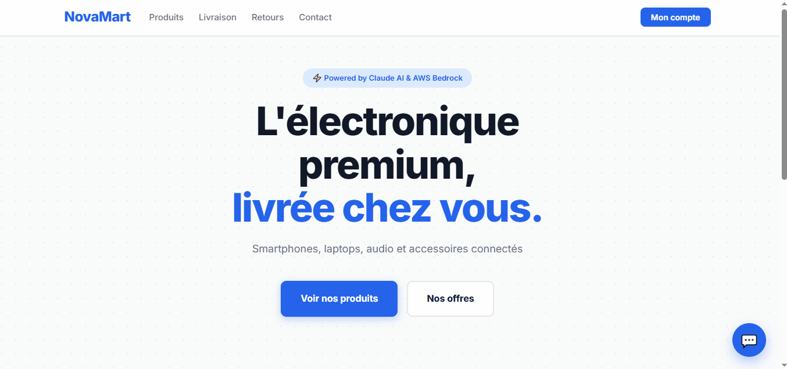

# NovaMart AI Support Chatbot


Production-ready AI customer support chatbot powered by AWS Bedrock Knowledge Bases and Claude Sonnet — with real-time streaming and embeddable widget.

---

## Live Demo



- **API health check:** https://web-production-fb44b.up.railway.app/health
- **Try it live:** https://aymenfouatihaiautomation.github.io/novamart-support-chatbot/

---

## Architecture

```
Client Widget (HTML/JS)
      │  POST /chat/stream (SSE)
      ▼
FastAPI Backend (Railway)
      │
      ├── retrieve() ──► AWS Bedrock Knowledge Base
      │                        │
      │                   OpenSearch Serverless
      │                   (FAQ, retours, catalogue, livraison)
      │
      └── generate() ──► Anthropic Claude Sonnet 4.6
                              │
                         Streaming response
                              │
                         Client Widget
```

---

## Tech Stack

| Layer | Technology |
|-------|-----------|
| LLM | Anthropic Claude Sonnet 4.6 |
| RAG | AWS Bedrock Knowledge Bases |
| Vector DB | Amazon OpenSearch Serverless |
| Backend | FastAPI + Python 3.11 |
| Streaming | Server-Sent Events (SSE) |
| Frontend | Vanilla JS + marked.js |
| Deployment | Railway |
| Storage | AWS S3 |

---

## Features

- **RAG pipeline on AWS Bedrock** — no vector infrastructure to manage or scale.
- **Real-time streaming (SSE)** — word-by-word responses, ChatGPT-style.
- **Embeddable widget** — drop it into any e-commerce site with one `<script>` tag.
- **Grounded answers only** — the model replies strictly from the company's documents.
- **Multi-turn conversation** — context preserved across a session via `session_id`.
- **Smart mock mode** — full local development without AWS credentials.

---

## Quick Start

### 1. Backend

```bash
cd backend
python -m venv .venv
# Windows: .venv\Scripts\activate   |   macOS/Linux: source .venv/bin/activate
pip install -r requirements.txt

cp ../.env.example ../.env          # then fill in your real values
uvicorn main:app --reload --port 8000
```

Required environment variables (`.env`):

```
AWS_REGION=us-east-1
AWS_ACCESS_KEY_ID=...
AWS_SECRET_ACCESS_KEY=...
BEDROCK_KNOWLEDGE_BASE_ID=...
ANTHROPIC_API_KEY=sk-ant-...
```

Without valid credentials the API stays up and `/chat` returns a mock response.

### 2. Frontend

```bash
cd frontend
python -m http.server 3000
# open http://localhost:3000
```

By default the widget targets the Railway production API. To point it at your
local backend, edit `window.NOVAMART_CHAT_API` in `frontend/index.html`.

### 3. Upload documents to the Knowledge Base

```bash
python scripts/upload_to_s3.py --bucket <your-bucket> --prefix novamart/
# then sync the Bedrock Knowledge Base data source
```

### Endpoints

| Method | Path | Description |
|--------|------|-------------|
| `GET` | `/health` | Liveness probe |
| `POST` | `/chat` | Single JSON response `{response, session_id}` |
| `POST` | `/chat/stream` | Streaming response (`text/event-stream`, SSE) |

---

## Project Structure

```
novamart-support-chatbot/
├── backend/
│   ├── main.py              # FastAPI app: /health, /chat, /chat/stream
│   ├── chat.py              # RAG logic: retrieve() + generate() (+ streaming)
│   ├── config.py            # Environment configuration
│   └── requirements.txt     # Backend dependencies
├── frontend/
│   ├── index.html           # Demo page embedding the widget
│   ├── widget.js            # Embeddable chat widget (SSE + Markdown)
│   └── style.css            # Widget styles
├── documents/
│   ├── faq.txt              # NovaMart FAQ
│   ├── politique-retours.txt # Returns & refund policy
│   ├── catalogue-produits.txt # Product catalog
│   └── guide-livraison.txt  # Delivery guide (zones & lead times)
├── scripts/
│   └── upload_to_s3.py      # Push documents to S3 for the Knowledge Base
├── Procfile                 # Railway process definition
├── requirements.txt         # Root deps (Railway build)
├── .env.example             # Environment template
└── README.md
```

---

## Business Value

- Cuts support ticket volume by **40–60%**.
- Available **24/7** at no additional headcount cost.
- Deployable on any e-commerce store in **under 48 hours**.
- Retrainable on **any company's documents** — swap the files, resync, done.

---

## 🔧 Adapter ce chatbot à votre business

Ce chatbot est conçu pour être déployé sur n'importe quel e-commerce
en moins de 48 heures. Voici comment :

### 1. Préparez vos documents (1-2 heures)
Remplacez les fichiers dans `documents/` par vos propres documents :
- `faq.txt` — Vos questions fréquentes
- `politique-retours.txt` — Votre politique de retours
- `catalogue-produits.txt` — Votre catalogue produits
- `guide-livraison.txt` — Vos délais et zones de livraison

Formats supportés : `.txt`, `.pdf`, `.docx`

### 2. Uploadez vers AWS S3 (5 minutes)
```bash
python scripts/upload_to_s3.py --bucket votre-bucket --prefix votre-marque/
```

### 3. Synchronisez la Knowledge Base (2 minutes)
Dans la console AWS Bedrock → votre Knowledge Base → "Sync"

### 4. Déployez (10 minutes)
Configurez les variables d'environnement sur Railway/Render
et déployez depuis GitHub.

### 5. Intégrez le widget (2 minutes)
Ajoutez ces 2 lignes à n'importe quelle page web :
```html
<script>window.NOVAMART_CHAT_API = "https://votre-api.railway.app";</script>
<script src="https://votre-domaine/widget.js"></script>
```

### Cas d'usage testés
| Secteur | Documents | Résultat |
|---------|-----------|---------|
| E-commerce | FAQ + Catalogue + Livraison | ✅ Déployé (NovaMart demo) |
| SaaS | Documentation + Guide utilisateur | ✅ Compatible |
| Immobilier | Fiches biens + Conditions | ✅ Compatible |
| Restaurant | Menu + Allergènes + Horaires | ✅ Compatible |

---

## Author

**Aymen Fouatih** — AI Automation Freelancer
LinkedIn: https://www.linkedin.com/in/aymen-fouatih
